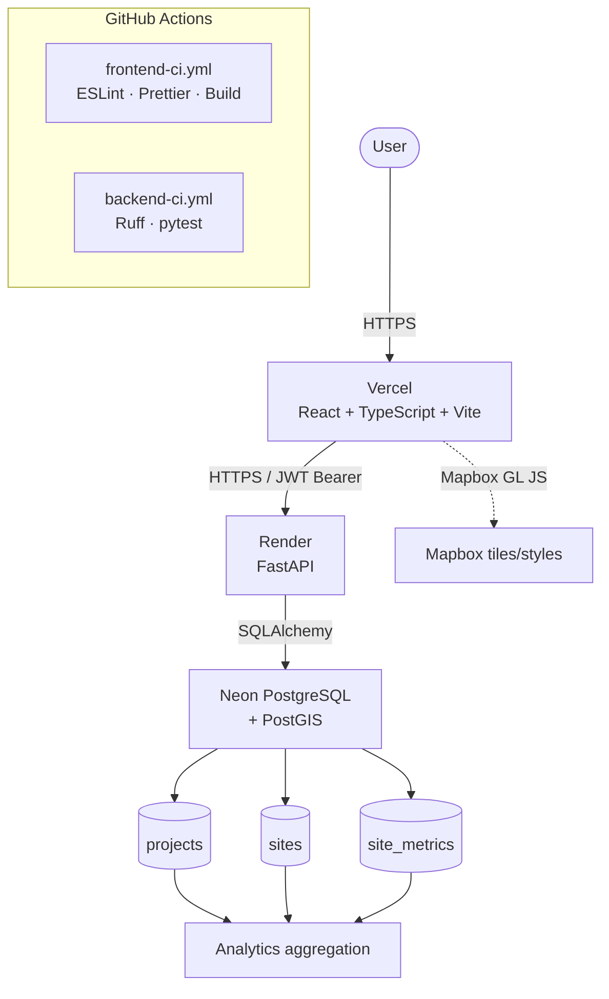
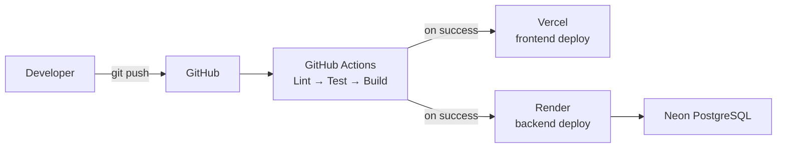
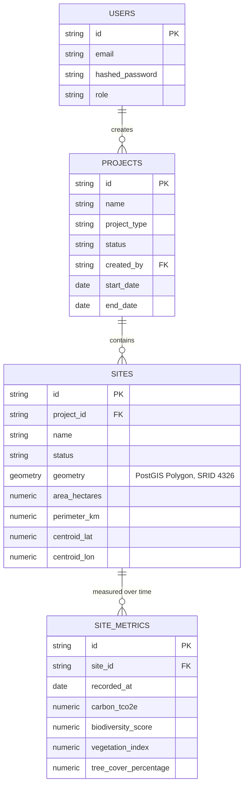

# Darukaa.Earth

Environmental intelligence platform for tracking restoration/conservation
**projects**, their geospatial **sites** (drawn as real polygons on a
map), and **environmental performance analytics** (carbon, biodiversity,
vegetation, tree cover) over time.

## Overview

Darukaa.Earth lets an authenticated user create projects, draw exact
site boundaries on a Mapbox map, persist them as real PostGIS geometry,
record environmental measurements over time, and explore the resulting
analytics through interactive Highcharts visualizations — all backed by
a JWT-authenticated FastAPI service and a Neon PostgreSQL + PostGIS
database.

## Features

- Email/password signup and login with bcrypt-hashed passwords and JWT
  bearer tokens
- Project management (create/list/update/delete) with per-user ownership
- Site management with Mapbox GL Draw polygon boundaries, stored as real
  PostGIS geometry (not JSON blobs)
- Backend-authoritative area/perimeter/centroid calculation via PostGIS
  spatial functions (never trusts client-computed geometry math)
- Environmental metrics (carbon sequestration, biodiversity score,
  vegetation index, tree cover %) with full CRUD and validation
- Site-level and project-level analytics: historical trend charts,
  performance-change calculations, empty states when no data exists
- Global analytics dashboard with filters (project/site/region/type/time
  range), a metric-driven map visualization mode, and a site performance
  table
- Responsive dashboard UI matching the Darukaa.Earth design system

## Architecture



Deployment flow:



## Technology Stack

| Layer | Choice |
|---|---|
| Frontend | React 19 + TypeScript + Vite, Tailwind CSS v4, Zustand, Axios, React Router |
| Maps | Mapbox GL JS + Mapbox GL Draw, Turf.js (client-side geometry preview) |
| Charts | Highcharts + highcharts-react-official |
| Backend | FastAPI + Uvicorn, SQLAlchemy 2.0, Pydantic v2 |
| Geospatial | PostGIS via GeoAlchemy2 + Shapely |
| Auth | bcrypt password hashing, PyJWT bearer tokens |
| Database | Neon PostgreSQL (serverless Postgres + PostGIS) |
| Migrations | Alembic |
| Hosting | Vercel (frontend), Render (backend) |
| CI/CD | GitHub Actions, Husky + lint-staged |
| Linting | ESLint + Prettier (frontend), Ruff (backend) |
| Testing | pytest + httpx (backend) |

## Project Structure

```
Daruka_Earth/
├── frontend/                  React + TypeScript + Vite app
│   ├── src/
│   │   ├── components/        Shared UI (charts, forms, map, dashboard shell)
│   │   ├── pages/              Route-level pages
│   │   ├── services/           Axios API clients (one per resource)
│   │   ├── store/               Zustand stores
│   │   └── types/                Shared TypeScript types
│   ├── .env.example
│   └── vercel.json
├── backend/                    FastAPI app
│   ├── app/
│   │   ├── api/routes/          Route handlers (thin — delegate to services/)
│   │   ├── core/                 Config, security, middleware, logging, rate limiting
│   │   ├── db/                    SQLAlchemy engine/session
│   │   ├── models/                 SQLAlchemy ORM models
│   │   ├── schemas/                 Pydantic request/response schemas
│   │   └── services/                 Business logic + authorization
│   ├── alembic/versions/            Migrations
│   ├── tests/                        pytest suite
│   ├── pyproject.toml                Ruff config
│   ├── render.yaml
│   └── .env.example
├── .github/workflows/           CI (frontend-ci.yml, backend-ci.yml)
├── .husky/                       Pre-commit hook
├── lint-staged.config.mjs
└── package.json                  Root: Husky + lint-staged only
```

## Database Schema



- **Project 1 → many Sites** (`sites.project_id`, `ON DELETE CASCADE`)
- **Site 1 → many SiteMetrics** (`site_metrics.site_id`, `ON DELETE CASCADE`) — one site accumulates a historical time series of measurements
- Ownership flows from `projects.created_by → users.id`; every site/metric/analytics read or write is authorized by walking up to the owning project — a user can never see or modify another user's data

Indexes: `projects(created_by)`, `projects(status)`, `sites(project_id)`,
`sites(status)`, `site_metrics(site_id)`, `site_metrics(recorded_at)`,
`site_metrics(site_id, recorded_at)` composite, and a **GiST spatial
index** on `sites(geometry)`.

## Geospatial Architecture


- **SRID 4326** (WGS84 lon/lat) is used throughout, matching GeoJSON's
  coordinate convention exactly — no reprojection needed between the map
  and the database.
- **Polygon storage**: `sites.geometry` is a real PostGIS
  `geometry(Polygon, 4326)` column (via GeoAlchemy2), not a JSON/text
  blob — this enables spatial indexing and server-side spatial functions.
- **Area/perimeter/centroid are always backend-computed.** The frontend's
  Turf.js calculation is a client-side preview only, shown during the Add
  Site review step for immediate feedback — the actual value persisted
  and returned by the API is computed server-side via `ST_Area`/
  `ST_Perimeter`/`ST_Centroid` after casting the geometry to `geography`
  (geodesic measurement, not planar-degree math, which would be wildly
  inaccurate away from the equator).
- **Spatial index**: a GiST index on `sites.geometry` keeps spatial
  queries efficient as the number of sites grows.
- **Validation**: geometry must be a closed `Polygon` ring with enough
  vertices, non-empty, non-zero-area, and topologically valid (rejects
  self-intersecting rings) — enforced both structurally (Pydantic) and
  geometrically (Shapely) before anything is written to PostGIS.

## Authentication

```
Signup:  plaintext password → bcrypt.hashpw() → hashed_password column
Login:   plaintext password → bcrypt.checkpw() against stored hash → JWT
Access:  Authorization: Bearer <token> → jwt.decode() → current_user
```

- Passwords are never stored, logged, or returned in plaintext.
- JWTs are signed with `JWT_SECRET_KEY` (HS256 by default), carry a
  `sub` (user id) claim and an expiration (`ACCESS_TOKEN_EXPIRE_MINUTES`,
  default 24h).
- Malformed, expired, or wrong-signature tokens all resolve to a generic
  `401 Unauthorized` — never a token-specific error message, and tokens
  are never logged anywhere.
- Every protected endpoint resolves the acting user from the JWT via
  `get_current_user` — no endpoint ever trusts a `user_id` supplied in a
  request body or query parameter.
- A lightweight in-memory rate limiter caps `/auth/signup` and
  `/auth/signin` at 10 requests/minute per IP to slow down brute-force
  attempts without adding external infrastructure (see Trade-offs).

## API

Interactive documentation is available at `/docs` (Swagger UI) and
`/redoc` on the running backend.

| Resource | Endpoints |
|---|---|
| Auth | `POST /auth/signup`, `POST /auth/signin`, `GET /auth/me` |
| Projects | `GET/POST /projects`, `GET/PATCH/DELETE /projects/{id}` |
| Sites | `GET/POST /sites` (filter via `?project_id=`), `GET/PATCH/DELETE /sites/{id}` |
| Metrics | `GET/POST /sites/{id}/metrics`, `PATCH/DELETE /sites/{id}/metrics/{metric_id}` |
| Analytics | `GET /sites/{id}/analytics`, `GET /projects/{id}/analytics`, `GET /analytics/dashboard` |
| Health | `GET /health` (liveness), `GET /health/db` (DB connectivity) |

All resource endpoints (everything except `/auth/signup`, `/auth/signin`,
and the health checks) require a valid `Authorization: Bearer <token>`
header and enforce ownership — see Authorization below.

### Error responses

| Status | Meaning |
|---|---|
| 401 | Missing, malformed, expired, or otherwise invalid token |
| 403 | Authenticated, but the resource belongs to a different user |
| 404 | Resource does not exist |
| 422 | Request validation failed (field-level errors returned) |
| 429 | Rate limit exceeded (auth endpoints only) |
| 500 | Unexpected server/database error — logged server-side, generic message returned to the client |

No endpoint ever returns a raw SQL error, stack trace, database
connection string, or filesystem path — see `app/main.py`'s exception
handlers.

### Authorization model

Ownership is rooted at `projects.created_by`. Sites, metrics, and
analytics all authorize by walking up to their parent project's owner:

```
metric → site → project → created_by == current_user.id ?
```

If not, the API returns `403 Forbidden`. If the resource simply doesn't
exist, it returns `404 Not Found` — the two are never conflated, so a
403 never leaks whether a resource exists for another user.

## Local Development

### Prerequisites
- Node.js `22.13.0` (see `frontend/.nvmrc`) — `npm ci` also works with any Node ≥ 20.19
- Python `3.13` (see `backend/.python-version`)
- A Neon PostgreSQL database (or any Postgres instance with the `postgis` extension available)

### Backend

```powershell
cd backend
python -m venv .venv
.\.venv\Scripts\pip install -r requirements-dev.txt
Copy-Item .env.example .env
# Edit .env: set DATABASE_URL to your Neon connection string and JWT_SECRET_KEY
# to a random value: python -c "import secrets; print(secrets.token_urlsafe(64))"

.\.venv\Scripts\alembic upgrade head
.\.venv\Scripts\python -m app.seed   # optional: seed demo data
.\.venv\Scripts\uvicorn app.main:app --reload
```

The API is now at `http://127.0.0.1:8000` (`/docs` for Swagger UI).

### Frontend

```powershell
cd frontend
npm ci
Copy-Item .env.example .env.local
# Edit .env.local: VITE_API_URL=http://127.0.0.1:8000, VITE_MAPBOX_TOKEN=<your token>
npm run dev
```

The app is now at `http://localhost:5173`.

## Environment Variables

**Backend** (`backend/.env`, never committed):

| Variable | Required | Description |
|---|---|---|
| `DATABASE_URL` | Yes | Neon/Postgres connection string, `postgresql+psycopg://...?sslmode=require` |
| `JWT_SECRET_KEY` | Yes | Random secret signing JWTs (accepts legacy alias `JWT_SECRET`) |
| `JWT_ALGORITHM` | No (default `HS256`) | JWT signing algorithm |
| `ACCESS_TOKEN_EXPIRE_MINUTES` | No (default `1440`) | Token lifetime |
| `CORS_ORIGINS` | Yes in prod | Comma-separated allowed frontend origin(s). Never `*` when `DEBUG=False` — enforced at startup |
| `DEBUG` | No (default `True`) | Set `False` in production |
| `ENVIRONMENT` | No (default `development`) | Informational label, surfaced in logs |

**Frontend** (`frontend/.env.local`, never committed) — only
browser-safe, `VITE_`-prefixed values:

| Variable | Required | Description |
|---|---|---|
| `VITE_API_URL` | Yes in prod | Backend base URL (`http://localhost:8000` dev, Render URL in prod) |
| `VITE_MAPBOX_TOKEN` | Yes | Mapbox GL JS public access token |

`DATABASE_URL`, `JWT_SECRET_KEY`, and every other backend secret are
never exposed to the frontend build — they simply don't exist in that
project's environment/config surface.

## Database Migration

```powershell
cd backend
.\.venv\Scripts\alembic upgrade head       # apply all migrations
.\.venv\Scripts\alembic downgrade -1        # roll back one revision
.\.venv\Scripts\alembic history             # list revisions
```

Migrations are purely additive — none drop existing tables/columns or
destroy data. The `postgis` extension, once enabled, is never dropped
even on downgrade.

## Testing

```powershell
cd backend
.\.venv\Scripts\pip install -r requirements-dev.txt
.\.venv\Scripts\python -m pytest -v
```

78 tests covering: signup/login (valid + invalid credentials), JWT
validation (missing/malformed/expired/wrong-signature tokens), password
hashing, rate limiting, project CRUD + authorization, site CRUD +
geometry validation (valid/invalid/self-intersecting/empty polygons) +
authoritative area calculation, metric CRUD + range validation, and
site/project/dashboard analytics aggregation (including cross-user data
isolation). Tests run against the real configured `DATABASE_URL`; each
test creates and cleans up its own throwaway user (cascading deletes
remove any projects/sites/metrics it created), so no test data persists.

Frontend: no dedicated test runner is configured yet (`npm run lint` +
`npm run build` are the current CI gate — see Trade-offs/Future
Improvements).

## Code Quality

- **Frontend**: ESLint (`typescript-eslint`, `eslint-plugin-react-hooks`)
  + Prettier, wired together via `eslint-config-prettier` so the two
  never disagree. `npm run lint`, `npm run format:check`.
- **Backend**: Ruff for both linting and formatting (`pyproject.toml`).
  `ruff check .`, `ruff format --check .`.
- **Pre-commit**: Husky + lint-staged run ESLint/Prettier on staged
  frontend files and Ruff on staged backend `.py` files only — fast,
  scoped to what actually changed.

## CI/CD

Two independent GitHub Actions workflows (`.github/workflows/`), each
triggered only by changes to its own subproject:

- **`frontend-ci.yml`**: checkout → Node setup (from `.nvmrc`) → `npm ci`
  → lint → format check → build.
- **`backend-ci.yml`**: checkout → Python setup (from `.python-version`)
  → install deps → Ruff check → Ruff format check → `alembic upgrade
  head` (against a disposable PostGIS service container) → `pytest`.

Both fail the build on any failing step.

## Deployment

- **Frontend → Vercel**: connect the repo, set the root directory to
  `frontend/`, framework preset "Vite". Set `VITE_API_URL` and
  `VITE_MAPBOX_TOKEN` in Vercel's environment variables. `vercel.json`
  includes a catch-all rewrite to `index.html` so client-side routes
  (`/dashboard`, `/sites/:id`, ...) resolve correctly on a hard refresh.
- **Backend → Render**: `backend/render.yaml` defines the web service
  (`uvicorn app.main:app --host 0.0.0.0 --port $PORT`, health check path
  `/health`). Set `DATABASE_URL` and `CORS_ORIGINS` (your Vercel URL) in
  Render's dashboard — `render.yaml` intentionally leaves these as
  `sync: false` so they're never committed.
- **Database → Neon**: unchanged; Render/your local machine both connect
  to the same Neon Postgres+PostGIS instance over the network. The
  database is never moved into Render itself.

After deploying, verify: frontend loads → `GET /health` returns `{"status":
"ok"}` → signup/login work → CORS allows the Vercel origin → dashboard
loads projects/sites → Mapbox renders → analytics charts render.

## Demo

1. Open the deployed Vercel URL.
2. Sign up (or sign in with the seeded demo account, see
   `backend/README.md` for credentials if you ran `python -m app.seed`).
3. Dashboard → Create Project → open it → Add Site → draw a polygon →
   save.
4. Refresh the browser — the site persists (loaded from PostGIS, not
   client state).
5. Open the site → add a measurement → view the analytics charts update.

## Trade-offs

- **React over a heavier framework (Next.js/Angular)**: this is a
  client-heavy dashboard with a separate FastAPI backend already
  providing the API layer — SSR/meta-framework routing wasn't a
  requirement, so plain React + Vite kept the build simple and fast.
- **FastAPI over Django**: the app is a thin, typed JSON API with no
  need for a full batteries-included framework (admin site, templating);
  FastAPI's Pydantic-first validation and automatic OpenAPI docs fit a
  geospatial/analytics API well with less boilerplate.
- **Neon over self-hosted Postgres**: serverless scale-to-zero billing
  and zero infrastructure to patch/back up, at the cost of occasional
  cold-start latency after idle periods (mitigated by `pool_pre_ping` +
  `pool_recycle`).
- **PostGIS over storing raw lat/lon pairs**: real polygon geometry
  enables authoritative area/perimeter/centroid via spatial SQL functions
  and a GiST spatial index — computing accurate geodesic area from raw
  coordinate pairs in application code would be slower and error-prone
  at any real dataset size.
- **Render over a container platform**: a single web service with a
  simple `uvicorn` start command didn't justify Kubernetes/ECS
  complexity; Render's git-push deploy model matches the project's scale.
- **Vercel for the frontend**: first-class Vite support, instant preview
  deployments per PR, and a generous free tier for a small dashboard app.
- **Highcharts over a lighter charting library**: already installed and
  used across every analytics view before this pass — richer built-in
  tooltip/legend/responsive behavior than a minimal library, at the cost
  of bundle size (mitigated by lazy-loading the dashboard route).
- **JWT over server-side sessions**: stateless auth means the API needs
  no session store, simplifying horizontal scaling — the trade-off is
  that revoking a single token before expiry isn't possible without
  adding a denylist, which this project doesn't need at its current
  scale.
- **In-memory rate limiting over Redis-backed**: adds meaningful
  brute-force protection on login/signup with zero added infrastructure;
  it resets on deploy and doesn't share state across instances, which is
  an accepted limitation for a single-instance deployment (see Future
  Improvements).

## Future Improvements

- Move rate limiting to a shared store (Redis) if the backend is ever
  scaled to multiple instances.
- Add a frontend test runner (Vitest + React Testing Library) for
  critical flows: login redirect, protected routes, project/site
  creation, analytics filter interactions.
- Add a JWT refresh-token flow so sessions can outlive the access
  token's expiry without a full re-login.
- Environmental analytics is the most recently added layer — the next
  planned feature (per the project's own roadmap) is deeper analytics:
  satellite-derived vegetation indices, richer time-series forecasting,
  and multi-site comparison tooling.
- Add a `site_events` audit-log table (the type already exists on the
  frontend as a placeholder) to record boundary edits/status changes
  over time.
